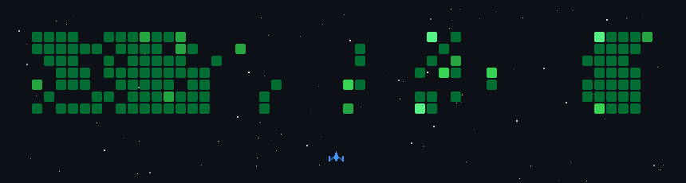

<!-- ===================== TOP GIF ===================== -->

  

<!-- ===================== HEADER ===================== -->

# 👋 Hey, I'm <b>Nikhil (Shravan) Tiwari</b>

### 🚀 <b>Building.</b> <b>Securing.</b> <b>Scaling.</b>

 

<!-- ===================== SOCIAL BUTTONS ===================== -->

---

# 🧠 About Me

💻 **MERN Stack Developer** focused on building scalable and high-performance web applications.  
🛡️ **Cybersecurity Enthusiast** exploring ethical hacking & secure coding practices.  
📚 Pursuing **Computer Science**, continuously upgrading my technical skills.  
🤝 Open to **collaborations, hackathons, and impactful projects.**

---

# 🛠️ Tech Arsenal

## 🌐 MERN Stack

  
  
  
  

## 💻 Core Web

  
  
  

---

# 📊 GitHub Insights

 

---

# ⚡ Current Focus

🔐 **Secure Full-Stack Applications**  
🚀 **Scalable MERN Architecture**  
🧠 **Cybersecurity & Ethical Hacking**  
📈 **Continuous Growth & Learning**

---

### ✨ <i>"Tech is an art. Code is my canvas."</i>

### 💡 <b>Let’s build something impactful together.</b>

